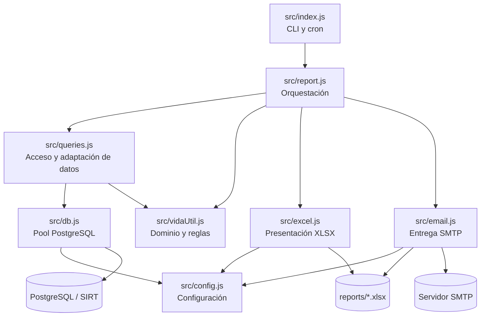
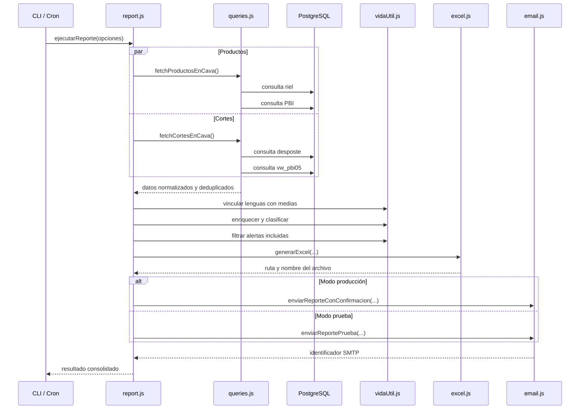

# Documentación técnica — Bot de vencimiento en cava

## Control del documento

- **Sistema:** Bot de vencimiento en cava — Colbeef
- **Versión documentada:** 1.0.0
- **Tipo de aplicación:** proceso batch programado y aplicación de consola
- **Plataforma operativa:** Windows
- **Runtime:** Node.js
- **Base de datos:** PostgreSQL / SIRT
- **Salida principal:** libro Microsoft Excel (`.xlsx`) enviado por correo electrónico
- **Audiencia:** desarrollo, soporte, infraestructura, calidad y responsables funcionales

> Este documento describe el comportamiento comprobado en el código fuente. Cuando se presenta una recomendación o una interpretación del propósito de una estructura externa, se identifica expresamente como tal.

---

## 1. Resumen ejecutivo

El Bot de vencimiento en cava automatiza la identificación, consolidación y notificación de productos y cortes próximos a vencer. El sistema consulta distintas fuentes de PostgreSQL, normaliza los datos obtenidos, aplica reglas de vida útil basadas en días hábiles, genera un archivo Excel con información ejecutiva y detallada y distribuye el resultado por SMTP.

El proceso cubre dos grupos:

1. **Productos en cava:** cabeza, patas y manos, vísceras, lengua y medias canales.
2. **Cortes en cava:** productos de desposte provenientes de tablas operativas y de una vista PBI.

Además de alertar productos cuyo vencimiento corresponde al siguiente o al segundo día hábil, el bot genera alertas preventivas para medias canales que alcanzan 8 o 10 días hábiles en cava.

La solución está organizada por responsabilidades:

- configuración;
- conexión a PostgreSQL;
- consultas y normalización de datos;
- reglas de negocio;
- generación de Excel;
- envío de correo;
- programación y ciclo de vida del proceso.

No existe una interfaz web, API HTTP, frontend ni persistencia propia. El bot actúa como consumidor de SIRT, procesador de datos y generador de reportes.

---

## 2. Objetivos del sistema

### 2.1 Objetivo principal

Reducir el riesgo operativo asociado al vencimiento de productos y cortes almacenados en cava mediante un reporte diario automatizado, trazable y distribuido a los responsables definidos.

### 2.2 Objetivos específicos

- Consultar inventario vigente en cava.
- Combinar información procedente de fuentes principales y de respaldo.
- Homogeneizar códigos, tipos de producto, textos y fechas.
- Calcular la fecha de vencimiento de productos según su vida útil.
- Detectar vencimientos relevantes para los dos próximos días hábiles.
- Alertar anticipadamente la permanencia de medias canales.
- Relacionar lenguas con medias canales pertenecientes al mismo animal.
- Consolidar resultados por tipo, propietario y cliente.
- Producir un Excel legible, filtrable y navegable.
- Enviar el reporte y su confirmación por correo electrónico.
- Permitir ejecución manual, de prueba y programada.

### 2.3 Alcance

El sistema incluye:

- lectura de variables de entorno;
- conexión a PostgreSQL;
- consultas de productos y cortes;
- transformación y deduplicación;
- cálculo de vencimientos;
- generación local de archivos Excel;
- envío SMTP;
- programación cron dentro del proceso Node.js;
- scripts Windows para inicio, detención, reinicio y autoinicio;
- scripts auxiliares para exploración y diagnóstico de datos.

### 2.4 Fuera de alcance

El repositorio no implementa:

- administración de usuarios;
- interfaz gráfica;
- API pública;
- modificación de registros en SIRT;
- migraciones de base de datos;
- calendario oficial de festivos;
- panel de monitoreo;
- almacenamiento histórico estructurado;
- rotación automática de logs;
- pruebas automatizadas;
- pipeline de integración o despliegue continuo.

---

## 3. Tecnologías utilizadas

### 3.1 Lenguajes y formatos

#### JavaScript

Es el lenguaje principal. El proyecto usa módulos ECMAScript, habilitados con `"type": "module"` en `package.json`.

Se utiliza para:

- configuración;
- acceso a datos;
- reglas de negocio;
- procesamiento asíncrono;
- generación del Excel;
- envío SMTP;
- programación cron;
- scripts de exploración.

#### SQL PostgreSQL

Las consultas SQL se encuentran embebidas en `src/queries.js` y en los scripts auxiliares. Se usan consultas parametrizadas cuando existe entrada variable.

#### Windows Batch y Command Script

Los archivos `.bat` y `.cmd` automatizan la operación del bot en Windows:

- instalación de dependencias;
- inicio oculto;
- captura de logs;
- administración del PID;
- detención y reinicio;
- instalación y eliminación del autoinicio.

#### PowerShell

Los scripts Batch invocan instrucciones de PowerShell para administrar procesos, accesos directos y tareas programadas.

#### VBScript

`iniciar-bot-oculto.vbs` permite iniciar el proceso sin dejar visible una ventana de consola.

#### JSON

Se usa en:

- `package.json`, como manifiesto del proyecto;
- `package-lock.json`, como bloqueo reproducible de dependencias.

#### Cron

`CRON_SCHEDULE` usa la sintaxis cron interpretada por `node-cron`.

### 3.2 Dependencias directas

- **dotenv:** carga las variables del archivo `.env`.
- **exceljs:** crea y formatea el libro Excel.
- **node-cron:** programa la ejecución diaria.
- **nodemailer:** crea el transporte SMTP y envía los correos.
- **pg:** administra el pool y las consultas PostgreSQL.

Versiones declaradas en `package.json`:

```json
{
  "dotenv": "^16.4.7",
  "exceljs": "^4.4.0",
  "node-cron": "^3.0.3",
  "nodemailer": "^6.10.0",
  "pg": "^8.13.3"
}
```

Las versiones exactas instalables están fijadas en `package-lock.json`. Este archivo debe conservarse versionado y la instalación productiva debe realizarse preferiblemente con `npm ci`.

### 3.3 Requisitos técnicos

- Windows con acceso a consola o PowerShell.
- Node.js 20 LTS o posterior recomendado.
- npm compatible con la versión de Node.js.
- Acceso de red al servidor PostgreSQL.
- Acceso de red al servidor SMTP.
- Credenciales de solo lectura para las consultas, siempre que el esquema operativo lo permita.
- Permiso de escritura en `reports/` y `logs/`.
- Microsoft Excel o software compatible para abrir el resultado; no se requiere Excel para generar el archivo.

---

## 4. Arquitectura

### 4.1 Estilo arquitectónico

La aplicación sigue una arquitectura modular por capas ligeras. No utiliza un framework ni contenedores de inyección de dependencias. Los módulos se relacionan mediante imports estáticos y funciones.



### 4.2 Principios observados

- **Separación de responsabilidades:** cada módulo atiende una preocupación principal.
- **Procesamiento funcional:** predominan funciones puras o casi puras y objetos planos.
- **Asincronía:** consultas independientes y grupos de fuentes se ejecutan concurrentemente.
- **Degradación parcial:** el fallo de una fuente puede permitir continuar con otra.
- **Configuración externa:** las credenciales y opciones operativas se leen del entorno.
- **Adaptación temprana:** los datos se normalizan inmediatamente después de la consulta.

### 4.3 Dependencias internas

```text
src/index.js
└── src/report.js
    ├── src/queries.js
    │   ├── src/db.js
    │   │   └── src/config.js
    │   └── src/vidaUtil.js
    ├── src/vidaUtil.js
    ├── src/excel.js
    │   ├── src/config.js
    │   └── src/vidaUtil.js
    └── src/email.js
        └── src/config.js
```

---

## 5. Estructura del repositorio

```text
reporte-vencimiento/
├── src/
│   ├── index.js
│   ├── config.js
│   ├── db.js
│   ├── queries.js
│   ├── vidaUtil.js
│   ├── report.js
│   ├── excel.js
│   └── email.js
├── scripts/
│   └── utilidades de exploración y diagnóstico
├── iniciar-bot-reportes.bat
├── detener-bot-reportes.bat
├── reiniciar-bot-reportes.bat
├── instalar-autoinicio.bat
├── desinstalar-autoinicio.bat
├── iniciar-bot-oculto.vbs
├── colbeef-bot-reportes.cmd
├── package.json
├── package-lock.json
├── .env.example
├── .gitignore
└── DOCUMENTACION_TECNICA.md
```

### 5.1 Directorios generados durante la ejecución

- `reports/`: almacena los archivos `.xlsx`.
- `logs/`: almacena el log del proceso y el archivo de PID cuando se usan los lanzadores Windows.

Estos directorios no forman parte del código fuente y están excluidos de Git.

### 5.2 Directorio `scripts/`

Contiene herramientas manuales para investigar el esquema y validar datos de SIRT. No forman parte del flujo productivo normal. Algunas de sus finalidades son:

- inspeccionar tablas y columnas;
- comparar fuentes;
- validar códigos y sufijos;
- analizar relaciones lengua–media canal;
- consultar cavas;
- revisar medias canales;
- explorar fuentes de cortes.

Estos scripts pueden mostrar datos operativos en consola. Deben ejecutarse solamente por personal autorizado y en un entorno controlado.

---

## 6. Flujo completo de ejecución



### 6.1 Inicialización

1. Node.js carga `src/index.js`.
2. Los imports cargan `src/config.js`.
3. `dotenv` busca exclusivamente `.env` en la raíz del proyecto.
4. `src/db.js` construye el pool PostgreSQL.
5. `src/index.js` interpreta los argumentos de línea de comandos.
6. Se imprime información operativa no sensible.

### 6.2 Obtención de datos

`ejecutarReporte` inicia simultáneamente:

- `fetchProductosEnCava()`;
- `fetchCortesEnCava()`.

Cada función consulta en paralelo sus fuentes habilitadas. Las consultas se encapsulan con `Promise.allSettled`, lo que permite recibir resultados parciales si una fuente falla.

### 6.3 Transformación de productos

1. Normalización de cada fila al salir de la capa SQL.
2. Deduplicación y prioridad de la fuente de riel.
3. Relación de lenguas con medias canales.
4. Cálculo de vida útil y fecha de vencimiento.
5. Cálculo de días hábiles en cava.
6. Clasificación de alerta.
7. Selección de registros incluidos en el reporte.

### 6.4 Transformación de cortes

1. Selección de fuentes según `CORTES_FUENTE`.
2. Normalización a un modelo común.
3. Deduplicación.
4. Conversión y formato de fechas.
5. Clasificación para el siguiente o segundo día hábil.
6. Filtrado de registros no relevantes.

### 6.5 Salida

1. Se genera un libro Excel en `reports/`.
2. Se construye el resumen para el correo.
3. En producción se envía el adjunto a todos los destinatarios.
4. Si existen destinatarios de notificación, se envía una confirmación adicional.
5. En prueba, el adjunto se envía únicamente a `REPORT_NOTIFY_TO`.

---

## 7. Reglas de negocio

### 7.1 Catálogo de vida útil

La vida útil se define en `VIDA_UTIL_HABILES`, dentro de `src/vidaUtil.js`:

- Cabeza: 4 días hábiles.
- Patas y Manos: 4 días hábiles.
- Vísceras Rojas: 4 días hábiles.
- Vísceras Blancas: 4 días hábiles.
- Lengua: 4 días hábiles.
- Media Canal 1: 12 días hábiles.
- Media Canal 2 Cola: 12 días hábiles.

Los nombres internos de vísceras se almacenan sin tilde (`Visceras`), mientras las etiquetas de presentación sí contienen tildes.

### 7.2 Día hábil

`esDiaHabil(fecha)` considera hábiles lunes, martes, miércoles, jueves y viernes.

Sábado y domingo no se contabilizan. El código actual no consulta ni contiene un calendario de festivos colombianos.

### 7.3 Cálculo de vencimiento

`addDiasHabiles(fechaInicio, diasHabiles)`:

1. toma el ingreso como día cero;
2. avanza un día calendario;
3. incrementa el contador solo si el nuevo día es lunes a viernes;
4. finaliza al completar la vida útil.

Ejemplo conceptual:

```text
Ingreso: viernes
Vida útil: 4 días hábiles
Días sumados: lunes, martes, miércoles y jueves
Vencimiento calculado: jueves
```

### 7.4 Días hábiles en cava

`diasHabilesDesde(fechaInicio, hasta)` cuenta los días hábiles desde el ingreso hasta la fecha de corte de forma inclusiva. Si el día de ingreso es hábil, se cuenta como el primer día en cava.

Esta convención es distinta del cálculo de vencimiento, que trata el ingreso como día cero. La diferencia es intencional según los comentarios actuales del código, pero debe validarse con el responsable funcional antes de cambiar las reglas.

### 7.5 Clasificación de alertas

Los valores internos son:

- `mañana`: vence el siguiente día hábil;
- `pasado_mañana`: vence el segundo día hábil siguiente;
- `dia_8_cava`: media canal con 8 días hábiles en cava;
- `dia_10_cava`: media canal con 10 días hábiles en cava;
- `otro`: no cumple una condición de alerta.

Las alertas de vencimiento tienen prioridad. Una media canal que vence mañana conserva `mañana`, aunque también coincida con su día 8 o 10 en cava.

### 7.6 Alertas especiales para medias canales

Solo `Media Canal 1` y `Media Canal 2 Cola` reciben alertas de permanencia:

- día hábil 8: alerta preventiva;
- día hábil 10: segunda alerta.

Estas alertas se agregan al reporte aunque el vencimiento no corresponda a mañana ni pasado mañana.

### 7.7 Normalización de tipos

`normalizarTipo` consolida variantes:

- cualquier valor que comience con `Media Canal 1` se convierte en `Media Canal 1`;
- cualquier valor que comience con `Media Canal 2` se convierte en `Media Canal 2 Cola`;
- los demás valores se mantienen después de eliminar espacios exteriores.

### 7.8 Normalización de códigos

Cuando un código tiene dos segmentos, se añade un tercer segmento según el tipo:

- Cabeza: `6114`;
- Patas y Manos: `6493`;
- Vísceras Rojas: `60`;
- Vísceras Blancas: `61`;
- Lengua: `6000`;
- Media Canal 1: `1001`;
- Media Canal 2 Cola: `1002`.

Ejemplo:

```text
Código recibido: 2606-12533
Tipo: Lengua
Código normalizado: 2606-12533-6000
Animal base: 2606-12533
```

Si el código ya contiene tres o más segmentos, no se reemplaza su sufijo.

### 7.9 Vinculación entre lengua y media canal

La relación se obtiene con los dos primeros segmentos del código, denominados `animal_base`.

Para cada lengua:

1. se buscan medias canales con el mismo `animal_base`;
2. se da prioridad a `Media Canal 1`;
3. si no existe, se usa `Media Canal 2 Cola`;
4. se guardan el código y el tipo de la media vinculada;
5. si la lengua no tiene destino o sucursal, estos datos se heredan de la media.

La función no modifica directamente el objeto de entrada: genera nuevos objetos mediante propagación.

### 7.10 Deduplicación

Productos:

```text
codigo normalizado + "|" + tipo de producto
```

Cortes:

```text
identificacion + "|" + lote interno + "|" + corte + "|" + fecha de vencimiento
```

Para productos, la fuente de riel tiene prioridad sobre PBI.

---

## 8. Modelo de datos

### 8.1 Producto normalizado

Campos recibidos o adaptados:

- `codigo`: identificación normalizada.
- `codigo_raw`: identificación original.
- `tipo_producto`: tipo normalizado.
- `propietario`: empresa propietaria.
- `fecha_ingreso`: fecha de ingreso a cava.
- `cava`: nombre de cava.
- `riel`: identificador del riel.
- `sucursal`: sucursal asociada.
- `destino`: destino asociado.
- `observaciones`: texto complementario.
- `fuente`: `riel` o `pbi`.

Campos calculados:

- `animal_base`: primeros dos segmentos del código.
- `media_vinculada`: código de media canal asociado a una lengua.
- `media_vinculada_tipo`: tipo de la media asociada.
- `vida_util_habiles`: vida útil del catálogo.
- `fecha_vencimiento`: fecha presentada como `DD/MM/AAAA`.
- `fecha_vencimiento_iso`: fecha `AAAA-MM-DD`.
- `dias_habiles_en_cava`: permanencia calculada.
- `alerta`: clasificación interna.
- `alerta_label`: etiqueta para Excel y correo.

### 8.2 Corte normalizado

- `identificacion`: identificación del producto de desposte.
- `lote_interno`: código de lote interno.
- `lote_externo`: código de lote externo.
- `cliente`: cliente procedente de la fuente.
- `propietario`: agrupador normalizado para el reporte.
- `ubicacion`: cava o ubicación.
- `corte`: nombre del corte.
- `cantidad`: cantidad reportada.
- `kilos`: peso reportado.
- `fecha_produccion`: fecha normalizada.
- `fecha_vencimiento`: fecha visible.
- `fecha_vencimiento_iso`: fecha ISO calculada.
- `tipo_conservacion`: refrigeración u otra clasificación.
- `categoria`: categoría de origen.
- `fuente`: `desposte` o `vw_pbi05`.
- `alerta`: clasificación interna.
- `alerta_label`: etiqueta visible.

### 8.3 Fuentes de productos

Fuente principal de riel:

- `trazabilidad_proceso.parte_producto_cava_riel`;
- `trazabilidad_proceso.parte_producto`;
- `trazabilidad_proceso.tipo_parte_producto`;
- `trazabilidad_proceso.producto`;
- `trazabilidad_proceso.producto_empresa`;
- `organizaciones.empresa`;
- `trazabilidad_proceso.cava`;
- `trazabilidad_proceso.parte_producto_empresa`;
- `trazabilidad_proceso.parte_producto_empresa_local`;
- `organizaciones.sucursal`;
- `trazabilidad_proceso.destino`.

Fuente complementaria:

- `trazabilidad_proceso.vw_pbi01`.

La consulta principal exige que el producto no tenga fecha de salida, limita el ingreso a los últimos 200 días y restringe el resultado a 50.000 filas.

La fuente PBI se consulta solamente para medias canales y completa registros faltantes.

### 8.4 Fuentes de cortes

Fuente operativa de desposte:

- `desposte.producto_desposte`;
- `desposte.nombre_corte`;
- `desposte.corte`;
- `desposte.lote`;
- `desposte.lote_subproducto`;
- `desposte.cava_desposte`;
- `desposte.tipo_conservacion`.

Fuente consolidada:

- `trazabilidad_proceso.vw_pbi05`.

Ambas consultas limitan el vencimiento desde 7 días antes hasta 14 días después de `CURRENT_DATE`, con máximo de 50.000 registros por fuente. El filtrado de negocio posterior conserva únicamente las alertas incluidas.

---

## 9. Referencia técnica del código

### 9.1 `src/index.js` — entrada y ciclo de vida

#### Responsabilidad

Interpretar argumentos, registrar la programación, ejecutar el caso de uso y cerrar recursos.

#### `ipServidor()`

Recorre las interfaces de red del sistema y retorna la primera dirección IPv4 no interna. Si no encuentra una, retorna `127.0.0.1`. La dirección se utiliza únicamente en el log de inicio.

#### `main()`

- muestra configuración operativa;
- prioriza `--prueba`;
- ejecuta inmediatamente con `--now`;
- registra el cron cuando no hay ejecución inmediata;
- garantiza el cierre del pool en los modos de una sola ejecución.

#### Señales y errores

- Un rechazo de `main()` registra `Error fatal`, cierra el pool y termina con código 1.
- `SIGINT` cierra el pool y termina con código 0.
- El callback cron captura sus propios errores para mantener vivo el proceso.

### 9.2 `src/config.js` — configuración

#### Responsabilidad

Cargar `.env`, convertir valores y exponer un objeto de configuración central.

#### Funciones privadas

- `envStr(key, fallback)`: retorna una variable como texto.
- `envInt(key, fallback)`: convierte a número finito o usa el valor predeterminado.

#### Exportaciones

- `config`: configuración de PostgreSQL, SMTP, destinatarios, cron, cortes y rutas.
- `TIPOS_CAVA`: catálogo heredado de tipos de cava; no se usa en el flujo productivo actual.

El módulo no valida que las variables obligatorias existan ni verifica formatos de correo, cron o zona horaria.

### 9.3 `src/db.js` — PostgreSQL

#### Responsabilidad

Crear un único pool compartido y proporcionar una interfaz mínima de consulta y cierre.

#### Configuración del pool

- máximo: 4 conexiones;
- timeout de conexión: 60 segundos;
- timeout de inactividad: 30 segundos;
- SSL opcional.

#### `query(text, params = [])`

Delega en `pool.query`. Las excepciones de PostgreSQL se propagan al llamador.

#### `closePool()`

Finaliza el pool una sola vez mediante una bandera interna. Su idempotencia evita múltiples llamadas a `pool.end()`.

### 9.4 `src/queries.js` — acceso y adaptación de datos

#### Responsabilidad

Consultar las fuentes, transformar sus filas a contratos internos, combinar resultados y eliminar duplicados.

#### Funciones de apoyo

- `fmtDate(value)`: serializa `Date` o convierte el valor a texto.
- `normalizarFilaCava(row)`: adapta una fila de producto.
- `claveProducto(row)`: crea la clave de deduplicación.
- `normalizarFilaCorte(row, fuente)`: adapta una fila de corte.

#### Consultas de productos

- `fetchProductosCavaRiel()`: fuente principal, código completo y contexto de cava.
- `fetchProductosCavaPbi()`: respaldo de medias canales.
- `fetchProductosEnCava()`: ejecuta ambas fuentes, registra fallos, prioriza riel, deduplica y ordena.

#### Consultas de cortes

- `fetchCortesDesposte()`: consulta el esquema operativo de desposte.
- `fetchCortesPbi()`: consulta `vw_pbi05`.
- `fetchCortesEnCava()`: selecciona fuentes, ejecuta, registra fallos y deduplica.

#### Alias obsoletos

- `fetchProductos3DiasEnCava`;
- `fetchCortesPorVencer`.

Se mantienen por compatibilidad, pero el código nuevo debe usar los nombres actuales.

### 9.5 `src/vidaUtil.js` — dominio

#### Responsabilidad

Centralizar catálogos, fechas, normalización, cálculo de vida útil, clasificación y relación de productos.

#### Catálogos

- `VIDA_UTIL_HABILES`;
- `TIPOS_REPORTE`;
- `TIPOS_RESUMEN_ORDEN`;
- `ETIQUETA_TIPO`;
- `DIAS_ALERTA_MEDIA_CANAL`;
- `SUFIJO_CODIGO`.

#### Fechas

- `hoyEnBogota()`: obtiene el día calendario actual de Bogotá y lo representa en UTC.
- `parseFecha(value)`: admite `Date`, `AAAA-MM-DD` y `DD/MM/AAAA`.
- `fmtFecha(date)`: produce `DD/MM/AAAA`.
- `fmtFechaIso(date)`: produce `AAAA-MM-DD`.
- `esDiaHabil(date)`: excluye sábado y domingo.
- `addDiasHabiles(start, amount)`: suma días hábiles.
- `diasHabilesDesde(start, end)`: cuenta permanencia inclusiva.
- `diaHabilDesdeHoy(offset)`: calcula el enésimo día hábil futuro.

#### Producto

- `normalizarTipo(tipo)`;
- `normalizarCodigoProducto(codigo, tipo)`;
- `vidaUtilDe(tipo)`;
- `esMediaCanal(tipo)`;
- `enriquecerProducto(producto)`;
- `animalBase(codigo)`;
- `vincularLenguaConMediaCanal(productos)`.

#### Alertas

- `clasificarAlerta(fechaVencimiento, hoy)`;
- `incluirEnReporte(item)`;
- `filtrarProximos(items)`.

#### Corte

- `enriquecerCorte(corte)`.

### 9.6 `src/report.js` — caso de uso

#### Responsabilidad

Coordinar el proceso completo sin contener detalles SQL, SMTP o de formato Excel.

#### `ejecutarReporte(options)`

Opciones:

```js
{
  enviarCorreo: true,
  modo: "produccion"
}
```

Comportamiento:

- obtiene la fecha del reporte;
- consulta productos y cortes;
- aplica vinculación, enriquecimiento y filtrado;
- genera el archivo;
- construye el resumen;
- envía según el modo;
- retorna el resultado procesado.

Retorno:

```js
{
  fechaReporte,
  productos,
  productosEnCava,
  cortes,
  ruta,
  resumen
}
```

`enviarCorreo: false` permite generar el Excel sin enviarlo, aunque no existe actualmente un script npm que exponga directamente esa opción.

#### `shutdown()`

Cierra el pool PostgreSQL.

### 9.7 `src/excel.js` — presentación

#### Responsabilidad

Transformar los datos procesados en un libro Excel corporativo.

#### Funciones internas principales

- `fillRow`: aplica un color a toda una fila.
- `estiloEncabezado`: configura encabezados.
- `borderThin`: retorna bordes uniformes.
- `autoAncho`: calcula ancho de columnas dentro de límites.
- `titulo`: crea una franja de título combinada.
- `resumenPorTipo`: calcula estadísticas por producto.
- `resumenPropietarios`: agrupa productos.
- `resumenCortesCliente`: agrupa cortes.
- `colorAlerta`: traduce alerta a color.
- `aplicarHipervinculo`: crea navegación entre hojas.
- `agregarTabla`: intenta crear una tabla con filtros.
- `hojaDetalleProductos`: construye el detalle y registra anclas.

#### `generarExcel(input)`

Entrada:

```js
{
  productos,
  productosEnCava,
  cortes,
  fechaReporte
}
```

Crea el directorio si no existe, escribe el libro y retorna:

```js
{
  ruta,
  nombreArchivo,
  fManana,
  fPasado
}
```

### 9.8 `src/email.js` — entrega SMTP

#### Responsabilidad

Crear el contenido HTML, adjuntar el Excel, enviar el reporte y notificar el resultado.

#### Funciones internas

- `cuerpoHtmlReporte`: crea el resumen visual.
- `crearTransportador`: configura Nodemailer.
- `destinatariosReporteCompleto`: une y deduplica destinatarios.

#### Funciones públicas

- `enviarReporte`: envío genérico con adjunto.
- `enviarReportePrueba`: envío restringido de prueba.
- `enviarReporteConConfirmacion`: flujo completo de producción.
- `enviarConfirmacionEnvio`: aviso adicional sin adjunto.
- `verificarSmtp`: comprueba la conexión SMTP.

---

## 10. Archivo Excel

### 10.1 Nombre

```text
reporte-vencimiento-cava-DDMMYYYY.xlsx
```

### 10.2 Hojas

#### `Resumen`

Incluye:

- fecha del reporte;
- fechas de los dos próximos días hábiles;
- vida útil por tipo;
- total en cava;
- total próximo a vencer;
- alertas por día;
- alertas de medias canales;
- resumen de cortes;
- leyenda de colores.

#### `Productos - Resumen`

Agrupa por propietario, muestra cantidades por tipo y enlaza al primer registro correspondiente en `Detalle Productos`.

#### `Detalle Productos`

Incluye propietario, código, animal base, media vinculada, tipo, alerta, fechas, vida útil, días en cava, ubicación, destino, sucursal y observaciones.

#### `Cortes - Resumen`

Agrupa cortes por cliente o propietario y enlaza al detalle.

#### `Detalle Cortes`

Incluye cliente, corte, alerta, identificación, lote, fechas, ubicación, kilos y conservación.

### 10.3 Convención visual

- Naranja: vence mañana.
- Azul: vence pasado mañana.
- Amarillo: media canal en día 8.
- Rojo: media canal en día 10.
- Verde: encabezados corporativos.

Las hojas usan paneles congelados, bordes, ancho automático, filtros e hipervínculos internos. Si ExcelJS no puede agregar una tabla, el error se omite y la hoja sigue siendo utilizable como rango normal.

---

## 11. Correos

### 11.1 Producción

Los destinatarios finales son la unión sin duplicados de:

- `REPORT_TO`;
- `REPORT_NOTIFY_TO`.

Todos reciben el Excel principal. Luego `REPORT_NOTIFY_TO` recibe una confirmación adicional.

### 11.2 Prueba

El modo prueba:

- envía únicamente a `REPORT_NOTIFY_TO`;
- agrega `[PRUEBA]` al asunto;
- incluye una advertencia visible en el cuerpo;
- adjunta el mismo Excel completo.

### 11.3 Contenido

El correo presenta:

- fecha del reporte;
- fechas próximas;
- total de productos;
- distribución de alertas;
- total de cortes;
- conteo por tipo;
- archivo adjunto.

---

## 12. Configuración

### 12.1 Creación del entorno

No se debe versionar `.env`.

```powershell
Copy-Item .env.example .env
```

Después se reemplazan los valores de ejemplo por los valores autorizados del entorno.

### 12.2 PostgreSQL

- `POSTGRES_HOST`: host o dirección del servidor.
- `POSTGRES_PORT`: puerto; predeterminado `5432`.
- `POSTGRES_DB`: base de datos.
- `POSTGRES_USER`: usuario.
- `POSTGRES_PASSWORD`: contraseña.
- `POSTGRES_SSL`: `true` o `false`.

### 12.3 SMTP

- `SMTP_HOST`: servidor de correo.
- `SMTP_PORT`: puerto SMTP.
- `SMTP_USER`: usuario.
- `SMTP_PASSWORD`: contraseña.
- `SMTP_USE_TLS`: selección TLS definida por el proyecto.
- `SMTP_FROM`: dirección remitente.
- `SMTP_FROM_NAME`: nombre visible.

### 12.4 Destinatarios

- `REPORT_TO`: destinatarios principales separados por comas.
- `REPORT_NOTIFY_TO`: destinatarios de prueba y confirmación separados por comas.

### 12.5 Programación

- `CRON_SCHEDULE`: expresión cron; valor predeterminado `59 5 * * *`.
- `TIMEZONE`: zona horaria; valor predeterminado `America/Bogota`.

La expresión predeterminada significa todos los días a las 05:59 en la zona configurada.

### 12.6 Cortes

- `CORTES_FUENTE`: `adesposte`, `pbi05` o `both`.
- `DIAS_VENCIMIENTO_CORTES`: se carga, pero el código actual no la aplica.
- `CORTES_LOOKBACK_DIAS`: se carga, pero el SQL actual mantiene 7 días fijos.

### 12.7 Configuración obsoleta

- `DIAS_EN_CAVA`: se conserva por compatibilidad, pero la vida útil real procede de `VIDA_UTIL_HABILES`.

---

## 13. Instalación

### 13.1 Instalación reproducible

```powershell
Set-Location "C:\ruta\al\reporte-vencimiento"
Copy-Item .env.example .env
npm ci
```

Luego:

1. editar `.env`;
2. comprobar conectividad a PostgreSQL;
3. comprobar conectividad SMTP;
4. ejecutar el modo prueba;
5. revisar el Excel;
6. habilitar la ejecución productiva.

### 13.2 Validación básica

```powershell
node --version
npm --version
npm run prueba
```

El modo prueba consulta datos reales y envía correo a los destinatarios de notificación. No debe ejecutarse sin revisar primero `.env`.

---

## 14. Ejecución

### 14.1 Daemon programado

```powershell
npm start
```

Mantiene el proceso activo y ejecuta el reporte según cron.

### 14.2 Reporte inmediato de producción

```powershell
npm run reporte
```

Genera, envía, cierra el pool y finaliza.

### 14.3 Reporte de prueba

```powershell
npm run prueba
```

Genera el reporte y lo envía únicamente a notificación.

### 14.4 Precedencia de argumentos

Si se suministran simultáneamente `--prueba` y `--now`, se ejecuta el modo prueba porque se evalúa primero.

---

## 15. Operación en Windows

### 15.1 Inicio

```powershell
.\iniciar-bot-reportes.bat
```

El script:

- comprueba Node.js;
- instala dependencias si no encuentra `node_modules`;
- detiene instancias anteriores;
- crea `logs/`;
- inicia el bot sin consola visible;
- redirige salida y errores al log;
- guarda un PID.

### 15.2 Detención

```powershell
.\detener-bot-reportes.bat
```

Intenta detener por PID y por coincidencias de línea de comandos.

### 15.3 Reinicio

```powershell
.\reiniciar-bot-reportes.bat
```

Reinicio con instalación de dependencias:

```powershell
.\reiniciar-bot-reportes.bat completo
```

### 15.4 Autoinicio

```powershell
.\instalar-autoinicio.bat
```

Configura:

- acceso directo en Inicio de Windows;
- tarea programada con retraso después del arranque, si se dispone de privilegios administrativos.

### 15.5 Desinstalación del autoinicio

```powershell
.\desinstalar-autoinicio.bat
```

Elimina los mecanismos de inicio y detiene el proceso.

---

## 16. Manejo de errores

### 16.1 Consultas

Las fuentes de un mismo grupo usan `Promise.allSettled`. Si una fuente falla:

- se registra una advertencia;
- se conserva la información de fuentes exitosas;
- continúa el reporte.

### 16.2 Generación del Excel

Los errores de creación del directorio o escritura del archivo se propagan y cancelan la ejecución.

La creación opcional de tablas Excel es una excepción: el error se ignora para conservar el libro como hoja normal.

### 16.3 SMTP

Los errores de lectura del adjunto, autenticación o envío se propagan al orquestador. No existen reintentos automáticos.

### 16.4 Cron

Un error durante una ejecución programada se registra y el daemon permanece activo para futuras ejecuciones.

### 16.5 Proceso principal

Un error fatal fuera del callback cron:

- se registra;
- intenta cerrar PostgreSQL;
- finaliza con código 1.

---

## 17. Logging y observabilidad

La aplicación utiliza:

- `console.log`;
- `console.warn`;
- `console.error`.

Cuando se inicia con los scripts Windows, la salida se redirige a:

```text
logs/bot-reportes.log
```

No existen:

- rotación;
- formato JSON;
- niveles configurables;
- correlación de ejecuciones;
- métricas;
- health check;
- alertas externas;
- retención automática.

Para soporte, deben verificarse:

1. fecha y hora del último inicio;
2. mensaje de generación;
3. cantidades consultadas;
4. ruta del Excel;
5. identificadores SMTP;
6. advertencias por fuente;
7. errores fatales.

---

## 18. Seguridad

### 18.1 Controles existentes

- `.env` se excluye de Git.
- Las contraseñas no están escritas en los módulos productivos.
- Las listas variables usadas en SQL se envían como parámetros.
- No existe superficie HTTP pública.
- El reporte de prueba tiene destinatarios separados.

### 18.2 Riesgos conocidos

- PostgreSQL SSL configura `rejectUnauthorized: false`.
- SMTP TLS puede configurar `rejectUnauthorized: false`.
- No se validan variables obligatorias al iniciar.
- El HTML interpola texto sin una función explícita de escape.
- Los scripts diagnósticos pueden imprimir registros sensibles.
- El log no tiene control de acceso ni rotación definidos por el proyecto.
- El mecanismo de detención busca fragmentos de línea de comandos y fuerza procesos.
- El archivo `.env.example` debe evitar direcciones internas y destinatarios reales si el repositorio se comparte fuera de la organización.

### 18.3 Recomendaciones

- Usar certificados válidos y activar su verificación.
- Usar una cuenta PostgreSQL de solo lectura con acceso mínimo.
- Proteger `.env`, `logs/` y `reports/` mediante permisos del sistema.
- Evitar incluir datos sensibles innecesarios en Excel y logs.
- Implementar validación de configuración al arrancar.
- Escapar contenido dinámico antes de interpolarlo en HTML.
- Definir una política de retención y eliminación segura.
- Rotar credenciales y no enviarlas por canales no autorizados.

---

## 19. Limitaciones y deuda técnica

### 19.1 Reportes vacíos ante fallo total

Si todas las fuentes de productos o cortes fallan, el uso de `Promise.allSettled` convierte el grupo fallido en una colección vacía. El proceso puede generar y enviar un reporte vacío sin diferenciarlo de un día sin datos.

**Recomendación:** exigir al menos una fuente exitosa por dominio o marcar explícitamente el reporte como parcial.

### 19.2 Ejecuciones simultáneas

No hay bloqueo. Dos ejecuciones pueden:

- consultar simultáneamente;
- escribir el mismo nombre de archivo;
- enviar correos duplicados.

**Recomendación:** implementar un mutex de proceso o archivo y añadir hora o identificador al archivo si se permiten múltiples ejecuciones.

### 19.3 Festivos

Solo se excluyen fines de semana.

**Recomendación:** integrar un calendario empresarial versionado o un proveedor controlado de festivos.

### 19.4 Zona horaria inconsistente

Las reglas de `vidaUtil.js` usan `America/Bogota` como constante, mientras cron y fecha del reporte usan `config.timezone`.

**Recomendación:** usar una única fuente de configuración.

### 19.5 Parámetro no efectivo

`clasificarAlerta(fechaVencimiento, hoy)` declara `hoy`, pero los días futuros se calculan mediante funciones que consultan la fecha global. Esto dificulta pruebas deterministas.

### 19.6 Variables desconectadas

`DIAS_VENCIMIENTO_CORTES`, `CORTES_LOOKBACK_DIAS` y `DIAS_EN_CAVA` no controlan actualmente el SQL o las reglas correspondientes.

### 19.7 Fuente de cortes inválida

Un valor de `CORTES_FUENTE` diferente de los admitidos crea cero tareas y devuelve cero cortes sin error.

### 19.8 Script auxiliar defectuoso

`scripts/test-cortes.mjs` importa símbolos que `src/queries.js` no exporta. El script no puede cargarse correctamente en su estado actual.

### 19.9 Ausencia de pruebas

No existe `npm test`. Las reglas de fechas, normalización, deduplicación y vinculación carecen de protección automática contra regresiones.

### 19.10 Cierre incompleto

Se maneja `SIGINT`, pero no `SIGTERM`, señal habitual de gestores de procesos y servicios.

### 19.11 Mensaje fijo

El texto de consola indica 05:59 aunque se modifique `CRON_SCHEDULE`.

### 19.12 Código legado

Existen constantes, opciones, funciones y alias no utilizados o heredados. Deben retirarse solo después de confirmar que no existen consumidores externos.

---

## 20. Estrategia de pruebas recomendada

### 20.1 Pruebas unitarias prioritarias

`vidaUtil.js`:

- parseo de formatos válidos e inválidos;
- fines de semana;
- suma desde viernes;
- permanencia inclusiva;
- transición de mes y año;
- normalización de medias canales;
- sufijos por tipo;
- prioridad de alertas;
- día 8 y día 10;
- vinculación de lengua;
- lengua sin media;
- herencia de destino y sucursal.

`queries.js`:

- normalización de valores nulos;
- prioridad riel sobre PBI;
- deduplicación;
- fuente inválida;
- una fuente fallida;
- todas las fuentes fallidas.

`report.js`:

- generación sin envío;
- modo prueba;
- modo producción;
- propagación de errores.

`email.js`:

- destinatarios vacíos;
- deduplicación;
- asunto y adjunto;
- escape de contenido.

### 20.2 Pruebas de integración

- PostgreSQL de prueba con datos conocidos.
- Generación y apertura del `.xlsx`.
- Verificación de nombres y hojas.
- SMTP de desarrollo o capturador local.
- ejecución cron controlada.

### 20.3 Casos de aceptación funcional

- producto que vence mañana;
- producto que vence el segundo día hábil;
- producto fuera de ventana;
- media canal en día 8;
- media canal en día 10;
- media canal que además vence mañana;
- lengua con Media Canal 1;
- lengua solo con Media Canal 2;
- viernes antes de fin de semana;
- día festivo, una vez exista calendario;
- reporte sin productos pero con cortes;
- reporte parcial por fuente no disponible.

---

## 21. Solución de problemas

### El bot no inicia

1. comprobar `node --version`;
2. ejecutar `npm ci`;
3. verificar que `.env` exista en la raíz;
4. revisar `logs/bot-reportes.log`;
5. ejecutar `npm run prueba` en una consola visible.

### Error de conexión PostgreSQL

1. verificar host, puerto, base y usuario;
2. comprobar conectividad y VPN;
3. validar reglas de firewall;
4. revisar si el servidor exige SSL;
5. confirmar permisos de lectura sobre tablas y vistas.

### El Excel se crea vacío

1. buscar advertencias `Productos (...)` o `Cortes (...)`;
2. ejecutar consultas de diagnóstico autorizadas;
3. validar `CORTES_FUENTE`;
4. revisar fecha del servidor PostgreSQL;
5. confirmar que existan registros dentro de las ventanas.

### El correo no llega

1. revisar credenciales SMTP;
2. validar puerto y modo seguro;
3. revisar destinatarios;
4. ejecutar una verificación SMTP controlada;
5. comprobar spam, políticas de relay y límites del servidor;
6. buscar el identificador de mensaje en logs.

### El cron no ejecuta

1. validar sintaxis de `CRON_SCHEDULE`;
2. validar `TIMEZONE`;
3. confirmar que el proceso permanezca activo;
4. revisar el autoinicio;
5. comprobar fecha y hora de Windows;
6. buscar errores del callback cron.

### Hay correos duplicados

1. verificar procesos Node.js activos;
2. revisar Startup y Task Scheduler;
3. detener todas las instancias;
4. iniciar una sola instancia;
5. implementar bloqueo antes de operar múltiples mecanismos de arranque.

---

## 22. Mantenimiento

### 22.1 Cambio de vida útil

Editar `VIDA_UTIL_HABILES` en `src/vidaUtil.js`, validar con el responsable funcional y ejecutar pruebas sobre fines de semana y fechas límite.

### 22.2 Nuevo tipo de producto

Revisar conjuntamente:

- `VIDA_UTIL_HABILES`;
- `TIPOS_RESUMEN_ORDEN`;
- `ETIQUETA_TIPO`;
- `SUFIJO_CODIGO`;
- normalización de tipos;
- consultas SQL;
- columnas y resúmenes Excel;
- casos de prueba.

### 22.3 Cambio de fuente SQL

Mantener la normalización como frontera. Los demás módulos deben seguir recibiendo el mismo contrato de objetos aunque cambien tablas o nombres de columnas.

### 22.4 Cambio de destinatarios

Modificar solamente `.env`. No insertar correos directamente en el código.

### 22.5 Actualización de dependencias

1. crear una rama;
2. actualizar con npm;
3. revisar cambios de `package-lock.json`;
4. ejecutar validaciones de sintaxis y pruebas;
5. generar un Excel real de prueba;
6. comprobar SMTP;
7. desplegar de forma controlada.

### 22.6 Limpieza

Definir tareas operativas para:

- eliminar reportes antiguos;
- rotar logs;
- conservar evidencia según política;
- vigilar espacio en disco.

---

## 23. Prioridades técnicas recomendadas

1. Detectar y bloquear reportes silenciosamente vacíos por fallo total de fuentes.
2. Añadir pruebas unitarias para fechas, alertas, códigos y vinculación.
3. Evitar ejecuciones solapadas.
4. Validar toda la configuración al arrancar.
5. Unificar el uso de zona horaria.
6. Conectar o eliminar variables de entorno sin efecto.
7. Corregir `scripts/test-cortes.mjs`.
8. Habilitar validación de certificados.
9. Escapar contenido HTML.
10. Añadir rotación de logs y manejo de `SIGTERM`.
11. Sustituir el mensaje fijo de horario por la configuración real.
12. Establecer monitoreo y alerta de ejecuciones fallidas.

---

## 24. Glosario

- **Alerta:** clasificación que determina la inclusión y el color de un registro.
- **Animal base:** dos primeros segmentos del código que identifican el animal.
- **Cava:** ubicación refrigerada donde permanece el producto.
- **Cron:** expresión que define cuándo se ejecuta una tarea.
- **Día hábil:** lunes a viernes en la implementación actual.
- **PBI:** vista consolidada usada como fuente complementaria; su significado institucional debe confirmarse con el propietario de datos.
- **Riel:** fuente principal del inventario de partes de producto en cava.
- **SIRT:** sistema PostgreSQL corporativo consultado por el bot.
- **SMTP:** protocolo usado para enviar el reporte por correo.
- **Vida útil:** cantidad de días hábiles desde el ingreso hasta el vencimiento calculado.

---

## 25. Conclusión

El Bot de vencimiento en cava implementa un flujo batch claro y modular para convertir datos operativos de SIRT en alertas accionables. Sus principales fortalezas son la separación de responsabilidades, la combinación de fuentes, la normalización centralizada, las reglas explícitas y la presentación ejecutiva en Excel.

Para aumentar su confiabilidad productiva, las mejoras de mayor impacto son distinguir ausencia real de datos de fallos de consulta, impedir ejecuciones concurrentes, automatizar las pruebas de calendario y negocio, validar la configuración y fortalecer la seguridad de conexiones y archivos.

Este documento debe actualizarse cuando cambien las reglas de vida útil, las fuentes SQL, la estructura del Excel, las variables de entorno o el procedimiento de despliegue.
